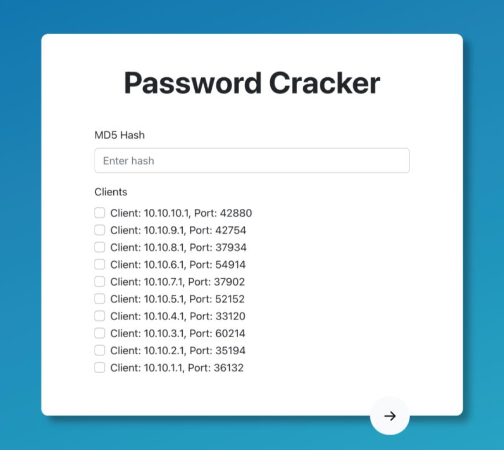
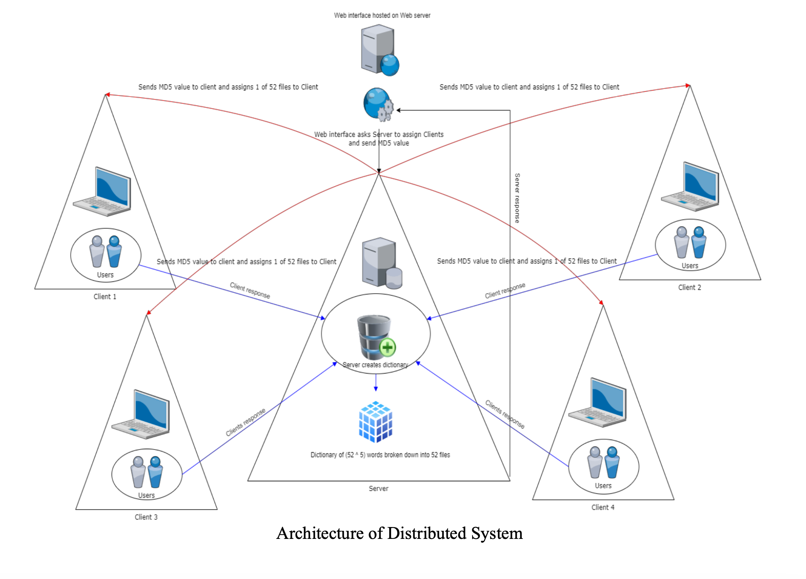
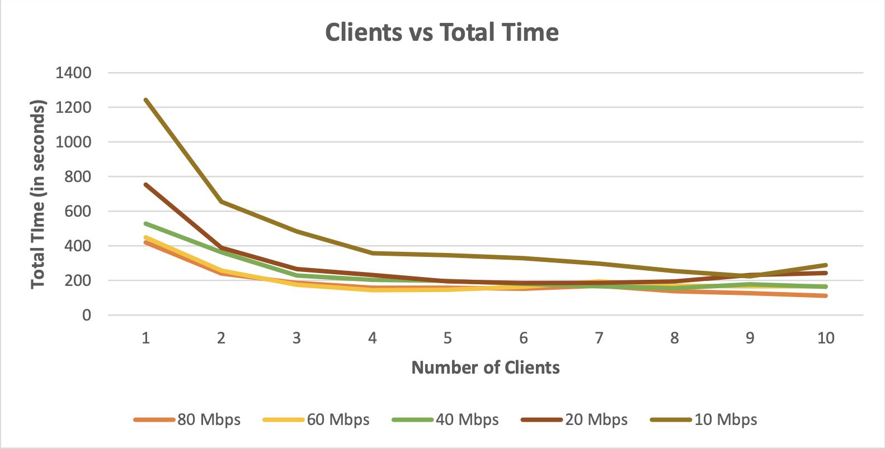

# Password Cracker

This is a mini-project for GRS CS 655 that aims to develop a password cracker using dictionary-based attacks.

## Problem

Passwords are an essential part of online security, but they can be easily compromised if they are not strong enough. Many users choose weak passwords that are easy to guess or crack, which can lead to unauthorized access to their accounts. Password cracking is the process of guessing or cracking passwords using various techniques like brute force attacks and dictionary-based attacks. Dictionary-based attacks are one of the most common methods used by attackers to crack passwords. In this method, the attacker uses a list of words from a dictionary file to try and guess the password.

## Solution

The goal of this project is to develop a password cracker that can crack passwords using dictionary-based attacks. The cracker should be able to read in a list of hashed passwords and corresponding usernames from a file, and then use a dictionary file to try and crack the passwords. The program should output the cracked passwords along with their corresponding usernames.

We developed our password cracker using Python and Flask web framework for building the webserver. The frontend is built using HTML/CSS/JS and hosted on Netlify. The webserver is hosted on Heroku.

The server node spreads the workload across selected number of clients in parallel. When a new client connects to the server, the server saves that client's socket in a list. The server passes the users MD5 hash input along with a different dictionary file to every client selected by the user. The clients attempt to brute force all the 5 letter combinations in the provided dictionary, to create the md5 hash and compare it with the MD5 hash obtained as user input. When a new request for cracking a new MD5 hash arises, the server creates a new thread for specified clients and repeat the process.

The front end communicates with the GENI password cracking server using https (port no 443) and internally the communication between the password cracking sever and clients is through TCP sockets.
The server holds a list of 52 files consisting of a total of 525 = 380,204,032 words. Each file consists of all possible combinations of 5 alphabets starting from an alphabet from the set {a...z,A...Z}. Total number of words in each file is 524 = 7,311,616.

When the server is launched, these files are created using multi-processing as it helps in faster creation of all the files. The server transmits one file along with the user MD5 hash to a client to decode. It keeps a list of files to transmit to clients and selects one from the list when a file must be sent to a client. When a client receives and processes the file, it returns the cracked password or a “Password Not Found” string if the MD5 hash obtained by brute forcing all the clients does not match with MD5 hash of the user. Then server passes the next file from the file queue to this client and this continues till a match is found or all the files are handled by the clients. When the password is discovered, the server uses web sockets to communicate the response to the user interface. The webserver uses REST APIs and web sockets to maintain a continuous connection to and from the frontend and to call server tasks as needed.

## Setup Diagram

The following diagram shows the setup for our password cracker:

## Observations

We restricted the bandwidth of the server on the interface communicating with the clients to 5 different values i.e., 80Mbps, 60 Mbps, 40Mbps, 20Mbps and 10 Mbps. For each of the value of the bandwidth then we varied the number of clients from 1 to 10.

We can observe the following in the above graph:
1. Time required to crack the given password decreases as we increase the number of clients for each of the bandwidth values. This is because as we add more clients, server distributes the files among all the clients and hence results in faster processing of to obtain he result. 
2. For higher bandwidth value the time required to crack a hash is lesser compared to time required to crack the same hash at lower bandwidth value keeping the number of clients constant because of the faster file transfer between the server and the client.

## Important Links

- [Github Link](https://github.com/atullal/password-cracker)
- Clone git repository: `git clone https://github.com/atullal/password-cracker`
- Download Project.zip folder: `wget https://github.com/atullal/password-cracker/blob/main/Project.zip`
- [Project Working Video Link](https://drive.google.com/file/d/1GiuQ0pWWLk7S17Vf2BSa-aGe23b7EaXp/view?usp=sharing)
